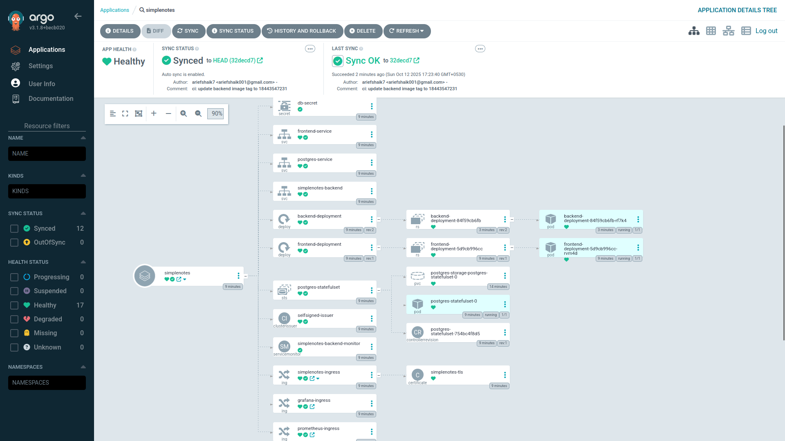

# 📝 SimpleNotes – End-to-End DevOps Pipeline


This repository contains a full-stack **Flask + React**  three-tier web application deployed on **Kubernetes** using GitOps. It demonstrates modern DevOps practices with a complete CI/CD pipeline.

#### Explore the [SimpleNotes Application Source Code](./simplenotes/README.md)


* **Frontend:** React app (served via Kubernetes `Deployment` and `Service`).
* **Backend:** Flask API (packaged as a container, deployed via Kubernetes `Deployment` and `Service`).
* **Database:** PostgreSQL deployed as a **StatefulSet** for persistent data storage. Persistent Volumes (PVCs) are used to ensure data durability across pod restarts.
* **Ingress:** Requests are routed via **Ingress-NGINX**, with path-based routing:

  * `/api` → backend service
  * `/` → frontend service

---


---

## 🚀 Technology Stack

<table><tbody><tr><td colspan="1" rowspan="1"><p>Category</p></td><td colspan="1" rowspan="1"><p>Technology</p></td></tr><tr><td colspan="1" rowspan="1"><p><strong>Frontend</strong></p></td><td colspan="1" rowspan="1"><p>React, Nginx</p></td></tr><tr><td colspan="1" rowspan="1"><p><strong>Backend</strong></p></td><td colspan="1" rowspan="1"><p>Python, Flask, Flask-SQLAlchemy, Flask-JWT-Extended</p></td></tr><tr><td colspan="1" rowspan="1"><p><strong>Database</strong></p></td><td colspan="1" rowspan="1"><p>PostgreSQL</p></td></tr><tr><td colspan="1" rowspan="1"><p><strong>Containerization</strong></p></td><td colspan="1" rowspan="1"><p>Docker</p></td></tr><tr><td colspan="1" rowspan="1"><p><strong>Orchestration</strong></p></td><td colspan="1" rowspan="1"><p>Kubernetes (AKS, EKS, GKE, Minikube)</p></td></tr><tr><td colspan="1" rowspan="1"><p><strong>CI/CD Automation</strong></p></td><td colspan="1" rowspan="1"><p>GitHub Actions</p></td></tr><tr><td colspan="1" rowspan="1"><p><strong>Continuous Deploy</strong></p></td><td colspan="1" rowspan="1"><p>Argo CD (GitOps)</p></td></tr><tr><td colspan="1" rowspan="1"><p><strong>IaC &amp; Packaging</strong></p></td><td colspan="1" rowspan="1"><p>Helm</p></td></tr><tr><td colspan="1" rowspan="1"><p><strong>Monitoring</strong></p></td><td colspan="1" rowspan="1"><p>Prometheus, Grafana</p></td></tr><tr><td colspan="1" rowspan="1"><p><strong>Code Analysis</strong></p></td><td colspan="1" rowspan="1"><p>SonarQube</p></td></tr><tr><td colspan="1" rowspan="1"><p><strong>Container Registry</strong></p></td><td colspan="1" rowspan="1"><p>Docker Hub</p></td></tr></tbody></table>

---


## 📁 Project Structure

The monorepo is organized to separate the frontend, backend, and infrastructure code, making it modular and easy to navigate.

```
flask-react-k8s/
├── .github/workflows/         # CI/CD pipelines for GitHub Actions
│   ├── backend-ci-cd.yaml     # Workflow for the Python backend
│   └── frontend-ci-cd.yaml    # Workflow for the React frontend
├── argocd/                      # Argo CD application manifest for GitOps
│   └── argocd-application.yaml
├── helm/simplenotes-app-chart/  # Helm chart for deploying all application components
│   ├── templates/               # Kubernetes manifest templates (Deployments, Services, Ingress, Statefulset etc.)
│   ├── Chart.yaml
│   └── values.yaml              # Default configuration values for the chart (image tags, replicas, etc.)
├── simplenotes/
│   ├── backend/                 # Source code for the Flask backend
│   │   ├── Dockerfile
│   │   └── sonar-project.properties # SonarQube config for the backend
│   └── frontend/                # Source code for the React frontend
│       ├── Dockerfile
│       └── sonar-project.properties # SonarQube config for the frontend
└── README.md                    # This main project guide
```

---


## ⚙️ Automated CI/CD Workflow

The entire pipeline is automated via GitHub Actions and operates on a GitOps principle. When code is pushed to the `master` branch in either the `simplenotes/frontend` or `simplenotes/backend` directories, the respective workflow is triggered.


### Pipeline Stages

1. **Build & Test**: The workflow sets up the required environment (Python/Node.js), installs dependencies, and runs any automated tests.
    
2. **Code Analysis**: SonarQube scans the codebase to detect bugs, vulnerabilities, and code smells, acting as an automated quality gate.
    
3. **Containerization**: A Docker image is built using the project's `Dockerfile`.
    
4. **Push to Registry**: The new image is tagged with a unique GitHub Actions run ID and pushed to Docker Hub.
    
5. **Helm Chart Update**: The pipeline automatically checks out the repository and updates the corresponding `image.tag` in the Helm chart's `values.yaml` file.
    
6. **GitOps Trigger**: The updated `values.yaml` is committed and pushed back to the GitHub repository.
    
7. **Automated Deployment**: ArgoCD, which is watching the repository, detects the change in the Helm chart and automatically syncs the deployment to the Kubernetes cluster, triggering a zero-downtime rolling update.
    

---


## 🚀 End-to-End Deployment Guide


### Step 1: Prerequisites & Setup

* **Fork this repository** to your own GitHub account.
    
* **Kubernetes Cluster**: Have access to a running Kubernetes cluster.
    
* **Tools**: Ensure `git`, `docker`, `kubectl`, and `helm` are installed locally.
    
* **SonarQube Server**: Set up a SonarQube instance (or use SonarCloud) and have the host URL and an access token ready.
    

### Step 2: Configure GitHub Secrets

In your forked repository, go to `Settings > Secrets and variables > Actions` and create the following secrets:

<table><tbody><tr><td colspan="1" rowspan="1"><p>Type</p></td><td colspan="1" rowspan="1"><p>Name</p></td><td colspan="1" rowspan="1"><p>Description</p></td></tr><tr><td colspan="1" rowspan="1"><p>Secret</p></td><td colspan="1" rowspan="1"><p><code>DOCKERHUB_USERNAME</code></p></td><td colspan="1" rowspan="1"><p>Your Docker Hub username.</p></td></tr><tr><td colspan="1" rowspan="1"><p>Secret</p></td><td colspan="1" rowspan="1"><p><code>DOCKERHUB_PASSWORD</code></p></td><td colspan="1" rowspan="1"><p>Your Docker Hub password or access token.</p></td></tr><tr><td colspan="1" rowspan="1"><p>Secret</p></td><td colspan="1" rowspan="1"><p><code>GIT_PAT</code></p></td><td colspan="1" rowspan="1"><p>GitHub PAT with <code>repo</code> scope to update Helm chart.</p></td></tr><tr><td colspan="1" rowspan="1"><p>Secret</p></td><td colspan="1" rowspan="1"><p><code>SONAR_TOKEN</code></p></td><td colspan="1" rowspan="1"><p>Your SonarQube analysis token.</p></td></tr><tr><td colspan="1" rowspan="1"><p>Secret</p></td><td colspan="1" rowspan="1"><p><code>SONAR_HOST_URL</code></p></td><td colspan="1" rowspan="1"><p>Your SonarQube server URL (e.g., <code>http://IP:9000</code>).</p></td></tr></tbody></table>

### Step 3: Kubernetes & ArgoCD Setup
| Orchestration    | Kubernetes (AKS, EKS, GKE, Minikube), StatefulSet |
a. Install NGINX Ingress Controller:

An Ingress controller is required to expose your services. For most cloud providers:


```
kubectl apply -f https://raw.githubusercontent.com/kubernetes/ingress-nginx/controller-v1.10.1/deploy/static/provider/cloud/deploy.yaml
```

**b. Install ArgoCD:**


```
kubectl create namespace argocd
kubectl apply -n argocd -f https://raw.githubusercontent.com/argoproj/argo-cd/stable/manifests/install.yaml

```

**c. Access ArgoCD:**


By default, the Argo CD API server is not exposed with an external IP. To access the API server, choose one of the following techniques to expose the Argo CD API server:
Service Type Load Balancer¶

Change the argocd-server service type to LoadBalancer:
```
kubectl patch svc argocd-server -n argocd -p '{"spec": {"type": "LoadBalancer"}}'
```
After a short wait, your cloud provider will assign an external IP address to the service. You can retrieve this IP with:
```
kubectl get svc argocd-server -n argocd -o=jsonpath='{.status.loadBalancer.ingress[0].ip}'
```
---
### ArgoCD Application Overview
Below is a screenshot of the ArgoCD UI showing the health and sync status of all application components:

---



---


#### Port Forwarding

Kubectl port-forwarding can also be used to connect to the API server without exposing the service.

```
kubectl port-forward svc/argocd-server -n argocd 8080:443

```
The API server can then be accessed using https://localhost:8080

#### Get initial password

```
kubectl -n argocd get secret argocd-initial-admin-secret -o jsonpath="{.data.password}" | base64 -d; echo
```

Now, navigate to `https://localhost:8080` and log in with username `admin` and the retrieved password.


If you are using a managed Kubernetes cluster, follow your provider's documentation to install these components.


### Step 4: Deploy the Application with ArgoCD

The `argocd/argocd-application.yaml` file defines your entire application stack for ArgoCD.

**Important:** Before applying, edit `argocd/argocd-application.yaml` and change the `repoURL` to point to **your forked repository's URL**.

YAML

```
# argocd/argocd-application.yaml
apiVersion: argoproj.io/v1alpha1
kind: Application
# ...
spec:
  source:
    # CHANGE THIS TO YOUR FORKED REPO URL
    repoURL: 'https://github.com/YOUR-USERNAME/flask-react-k8s.git'
    path: 'helm/simplenotes-app-chart'
# ...
```

Apply this manifest to your cluster. ArgoCD will immediately deploy the entire application suite.


```
kubectl apply -f argocd/argocd-application.yaml
```

ArgoCD will now ensure your cluster's state always matches your Git repository.

---

## Accessing the Deployed Application

### 1\. Configure Local DNS

You need to map the application's hostname to your Ingress controller's external IP address.

**a. Find your Ingress IP:**


```
kubectl get svc -n ingress-nginx # Or the namespace where your controller is
# Look for the EXTERNAL-IP of the LoadBalancer service
```

**b. Edit your local** `hosts` file:

* **macOS/Linux:** `sudo nano /etc/hosts`
    
* **Windows:** `C:\Windows\System32\drivers\etc\hosts` (as Administrator)
    

Add the following line:

```
<YOUR_INGRESS_IP>   simplenotes.com prometheus.local grafana.local
```

### 2\. Access the UIs


* **SimpleNotes Application:** http://simplenotes.com
* **Prometheus:** http://prometheus.local
* **Grafana:** http://grafana.local

---

## 📊 Monitoring with Prometheus & Grafana

This section details how to set up a robust monitoring stack for the Flask backend using **Prometheus** for metrics collection and **Grafana** for visualization.

### Overview of the Monitoring Architecture

1. **Flask Application**: The backend is instrumented with `prometheus-flask-exporter`, which exposes an HTTP endpoint at `/metrics` with key performance indicators (KPIs) like request latency and counts.
    
2. `ServiceMonitor`: This custom Kubernetes resource declaratively tells the Prometheus Operator to find our application's service (via labels) and automatically begin scraping its `/metrics` endpoint. This avoids manual Prometheus configuration.
    
3. **Prometheus**: Scrapes and stores the metrics from our application as time-series data.
    
4. **Grafana**: Visualizes the data stored in Prometheus. We will import a pre-built dashboard to get started quickly.
    
5. **Ingress**: Exposes the Prometheus and Grafana web UIs on user-friendly hostnames.
    
---

### Step-by-Step Monitoring Setup

#### Step 1: Deploy the Prometheus & Grafana Stack

We will use the `kube-prometheus-stack` Helm chart, which bundles Prometheus, Grafana, and the crucial **Prometheus Operator**.

**a. Add the required Helm repository:**


```
helm repo add prometheus-community https://prometheus-community.github.io/helm-charts
helm repo update
```

b. Install the chart:

This command installs the stack into a dedicated monitoring namespace.


```
helm install my-kube-prometheus prometheus-community/kube-prometheus-stack --namespace monitoring --create-namespace
```
---

#### Step 2: Enable Prometheus to Monitor Your App
Monitoring
The `ServiceMonitor` for the backend is already included in the Helm chart at `helm/simplenotes-app-chart/templates/servicemonitor.yaml`.

The crucial part is the label `release: my-kube-prometheus`. This label on the `ServiceMonitor` tells the specific Prometheus instance installed by the Helm chart to pay attention to it. Prometheus will then look for any Service in the `app` namespace that has the label `app: backend` and begin scraping its `/metrics` endpoint.

---

#### Step 3: Access Prometheus and Grafana via Ingress

The Ingress rules for Prometheus and Grafana are already included in the Helm chart. Once the main application is deployed via ArgoCD, these will be created automatically.

To access them, you must configure your local DNS.

**a. Find your Ingress Controller's External IP:**


```
# The namespace may vary based on your installation
kubectl get svc -n ingress-nginx
```

b. Edit your local hosts file:

Add the following line, replacing &lt;YOUR\_INGRESS\_IP&gt; with the IP from the previous step.

```
<YOUR_INGRESS_IP>   simplenotes.com prometheus.local grafana.local
```
---

#### Step 4: Access Grafana and Visualize

**a. Get the Grafana admin password:**


```
kubectl get secret --namespace monitoring my-kube-prometheus-grafana -o jsonpath="{.data.admin-password}" | base64 --decode ; echo
```

b. Log in to Grafana:

Open your browser and navigate to [http://grafana.local](http://grafana.local). Log in with the username admin and the password you just retrieved.

**c. Import a Dashboard:**

1. In the Grafana UI, go to **Dashboards**, click **New**, and then **Import**.
    
2. In the "Import via [grafana.com](http://grafana.com)" box, enter the dashboard ID: `14227` (Flask Metrics).
    
3. Click **Load**.
    
4. On the next screen, select your **Prometheus** data source at the bottom.
    
5. Click **Import**.
    

You will now have a dashboard visualizing the live metrics from your Flask backend! **Note: Data will only appear after you have generated traffic by using the web application (e.g., logging in, creating notes).**

---


## 🛠️ Local Development

To run the entire application stack locally for development, you can use the provided Docker Compose file.


```
# From the simplenotes/ directory
cd simplenotes
docker-compose up --build
```

* Frontend will be available at [`http://localhost:3000`](http://localhost:3000)
    
* Backend API will be available at [`http://localhost:5001`](http://localhost:5001)
    
* PostgreSQL will be available on port `5432`
    

---

## 🧹 Cleanup

To avoid ongoing cloud provider costs, delete the resources when you are finished.


```
# Delete the application from the cluster
kubectl delete -f argocd/argocd-application.yaml

# Uninstall ArgoCD and monitoring
kubectl delete namespace argocd
kubectl delete namespace app
helm delete my-kube-prometheus -n monitoring
kubectl delete namespace monitoring

# Delete your cloud-provider Kubernetes cluster (example for AKS)
# az group delete --name "MyResourceGroup" --yes --no-wait
```
---

## 📄 License
This project is licensed under the MIT License. See the `LICENSE` file for details.

## 🤝 Contributing
Contributions are welcome! Please open issues or submit pull requests for improvements.

---